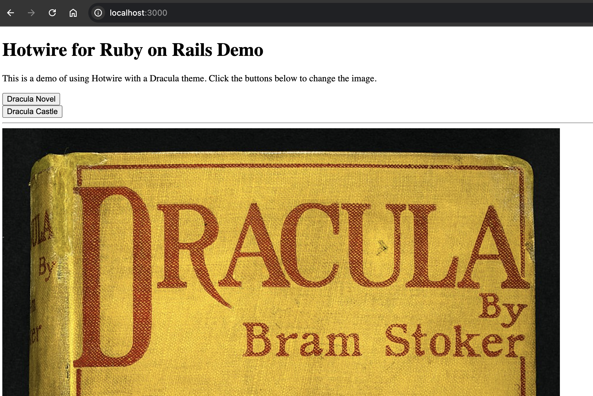
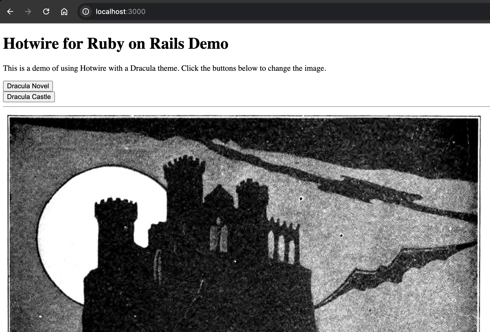

# Hotwire Turbo for Ruby on Rails with Dracula Theme

This is a Ruby on Rails web app to demo the use of the front-end libraries View Components and Hotwire Turbo.

Hotwire is built into Rails 8 as part of its front-end frameowrk. The Turbo part of Hotwire can be used to update parts of webpages using HTML and websockets. View components are objects for Ruby on Rails views that render to HTML. You can read more about the libraries at the links below:

- View Components: https://viewcomponent.org/
- Hotwire Turbo Website: https://turbo.hotwired.dev/
- Hotwire Turbo Rails Gem: https://github.com/hotwired/turbo-rails

It uses the topic theme of Dracula as this is the name of a popular Dev tool colour theme: https://draculatheme.com/

## Setup

Install the Ruby version in the `.ruby-version` file then run the terminal command `bundle install`.

## Run the web app

Using the terminal navigate to the root of the project directory and run the command:

```sh
bin/dev
```

Then open your internet browser, such as Chrome, and visit `http://localhost:3000/`

Click on the buttons on the webpage to see the Dracula themed imaged replaced using the Hotwire library.

## Run the tests

The test library used is the [rspec-rails](https://github.com/rspec/rspec-rails) gem.

Use the terminal command `bin/rspec` to run the tests for the view components and see the test output.

```
$ bin/rspec

ButtonComponent
  renders a button with the specified label, link and params

ImageComponent
  renders an image tag with the specified file

Dracula
  GET /dracula
    renders the Dracula novel image
  POST /dracula/image
    with params image: 'novel'
      renders a turbo steam containing the Dracula novel image
    with params image: 'castle'
      renders a turbo steam containing the Dracula castle image

Finished in 0.03688 seconds (files took 0.59829 seconds to load)
5 examples, 0 failures

```

## Front-end libraries used

### Ruby on Rails View Components

The guide to the view components library for Ruby on Rails apps can be found at: https://viewcomponent.org/guide

In this demo app:

- The view components used for rendering views are located in [`app/components`](/app/components/)
- The tests for the view components are located in [`spec/components`](/spec/components/)

Example image view component rendered in demo app image view partial:

https://github.com/rdsngit/hotwire-turbo-rails-demo/blob/d36dfae72ab93f45ec5ce8b0517b7bd047d34232/app/views/dracula/_image.html.erb#L1-L3

### Hotwire Turbo

Turbo frames updated using the morph refresh method: https://turbo.hotwired.dev/handbook/page_refreshes#morphing

https://github.com/rdsngit/hotwire-turbo-rails-demo/blob/d36dfae72ab93f45ec5ce8b0517b7bd047d34232/app/views/layouts/application.html.erb#L13

When the `DraculaController`'s `#image` action is sent a `POST` request with a param for one of images it will respond `turbo_stream.replace` with the rendered image generated from the view partial:

https://github.com/rdsngit/hotwire-turbo-rails-demo/blob/d36dfae72ab93f45ec5ce8b0517b7bd047d34232/app/controllers/dracula_controller.rb#L18-L24

Request specs for the Dracula `GET` and `POST` requests and turbo stream responses are located in:

- [/spec/requests/dracula_spec.rb](/spec/requests/dracula_spec.rb)

## Image sources

- Dracula novel image source: https://commons.wikimedia.org/wiki/Category:Dracula#/media/File:Dracula-First-Edition-1897.jpg
- Dracula castle image source: https://commons.wikimedia.org/wiki/File:Castle_Dracula.jpg

## Screenshots



