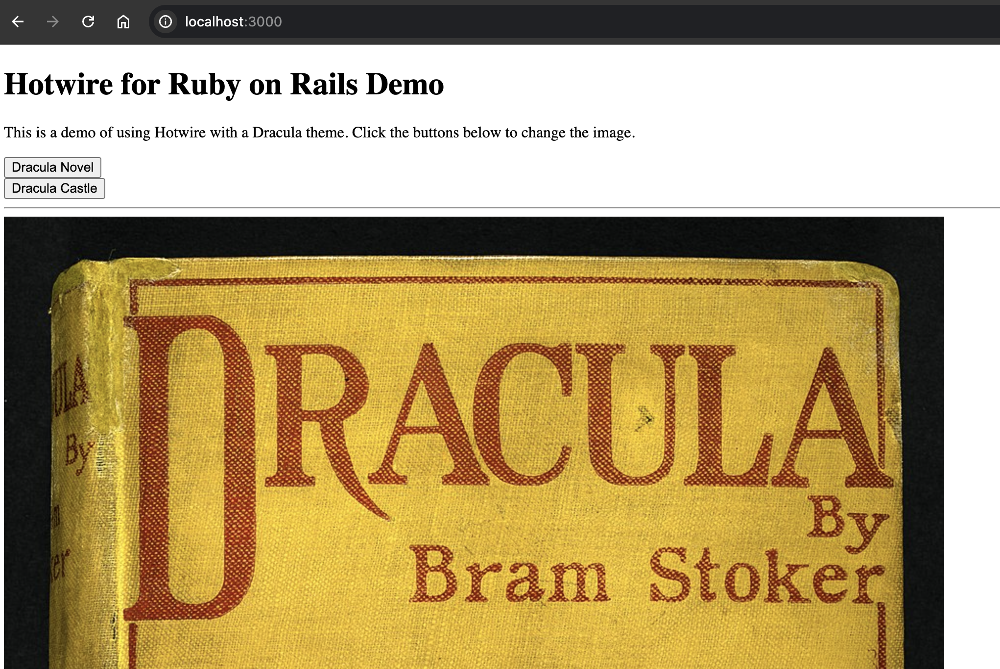
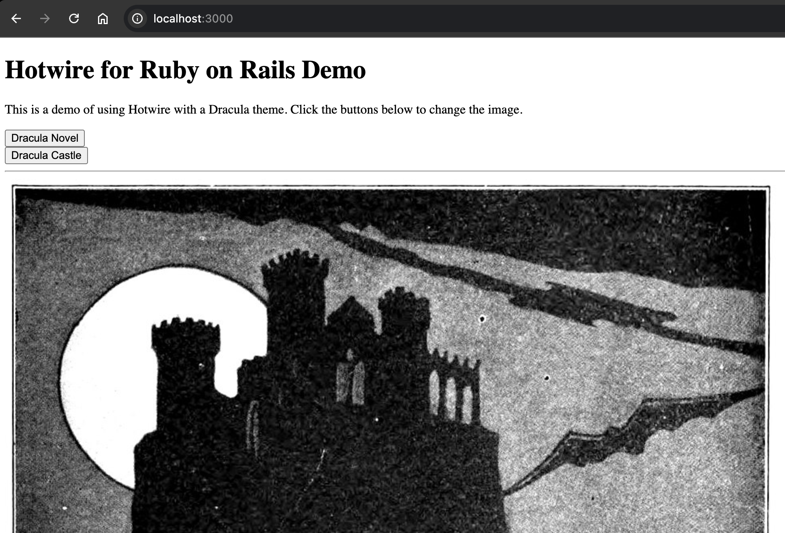

# Hotwire Turbo for Ruby on Rails with Dracula Theme

This is a Ruby on Rails web app to demo the use of the front-end libraries View Components and Hotwire Turbo.

- View Components: https://viewcomponent.org/
- Hotwire Turbo Website: https://turbo.hotwired.dev/
- Hotwire Turbo Rails Gem: https://github.com/hotwired/turbo-rails

It uses the topic theme of Dracula as this is the name of a popular Dev tool colour theme: https://draculatheme.com/

## Setup

Install the Ruby version in the `.ruby-version` file then run the terminal command `bundle install`.

## Run the web app

Using the terminal navigate to the root of the project directory and run the command:

```sh
bin/dev
```

Then open your internet browser, such as Chrome, and visit `http://localhost:3000/`

Click on the buttons on the webpage to see the Dracula themed imaged replaced using the Hotwire library.

## Front-end libraries used

View components library for Ruby on Rails apps: https://viewcomponent.org/guide

The view components used in the demo app are located in [`app/components`](app/components/)

Example image view component rendered in demo app image view partial:

https://github.com/rdsngit/hotwire-turbo-rails-demo/blob/d36dfae72ab93f45ec5ce8b0517b7bd047d34232/app/views/dracula/_image.html.erb#L1-L3

Turbo frames updated using the morph refresh method: https://turbo.hotwired.dev/handbook/page_refreshes#morphing

https://github.com/rdsngit/hotwire-turbo-rails-demo/blob/d36dfae72ab93f45ec5ce8b0517b7bd047d34232/app/views/layouts/application.html.erb#L13

When the `DraculaController`'s `#image` action is sent a `POST` request with a param for one of images it will respond `turbo_stream.replace` with the rendered image generated from the view partial:

https://github.com/rdsngit/hotwire-turbo-rails-demo/blob/d36dfae72ab93f45ec5ce8b0517b7bd047d34232/app/controllers/dracula_controller.rb#L18-L24

## Image sources

- Dracula novel image source: https://commons.wikimedia.org/wiki/Category:Dracula#/media/File:Dracula-First-Edition-1897.jpg
- Dracula castle image source: https://commons.wikimedia.org/wiki/File:Castle_Dracula.jpg

## Screenshots



